# SpeciMate User Guide — Collaborative Collections Metadata Extraction Tool
Create date: 2026-07-27
Last modified date: 2026-07-30

Companion guides:

- **Quick Start Guide** — a one-page tour of the main window.
- **Setting Up Services** — obtaining API keys and configuring providers in detail.
- **User Guide: Choosing and Using Definitions** — picking and building definitions.
- **Admin Guide: Prompt and Display Definitions** — setting definitions up for other people.

---

# Introduction

This document describes how to set up and use **SpeciMate** – the Specimen Collections Metadata Extraction Tool – to process digitised specimen images and extract the label metadata into named columns (or entities). These can then be checked and edited in a data curation process before exporting a complete dataset in tabular format, ready for further data quality curation and importing into your collection database.

SpeciMate itself does **not** perform OCR, translation or entity extraction. It sends your images and text to external AI web services that you configure, and pay for, yourself. See *Services selection and setup*.

## What has changed if you used an earlier version

If you have used SpeciMate before, three things work differently now:

| Then | Now |
|---|---|
| Choose a **specimen type** from a fixed dropdown | Choose a **definition** from the library, or create one |
| Curation screens were built into the application per specimen type | Curation screens come from **display definitions** you can edit |
| Folder of images plus loose OCR/NER data files | A **project**, stored in a `specimate` sub-folder inside the image folder |
| Services fixed and password-protected | Services fully configurable on the **Services** screen, provider-agnostic |

Nothing about the underlying workflow has changed: read the labels, extract the fields, check the result, export.

---

# Quick Start Guide

## Installation

* Download the SpeciMate.zip application as a compressed file (.zip) from the /binaries folder according to your platform.
* Extract the application to a location with write permissions.
* Copy the contents of the /Data folder and other data (see platform details below) to the same location as the application.
* On first launch, SpeciMate asks you to choose a **SpeciMate-Data** folder. If your institution already has one, point at it and you inherit its definitions, layouts and services. Otherwise accept the default and start empty.

## Basic Usage

### Processing

* **New Project** — name it, then point it at the folder containing your specimen images.
* **Select definition** Use the popup to access the definition library or create a new definition for your project. From the definition library, click **Apply** to use it within your project.
* At **Step 2: Select Processes**, tick the processes you want (OCR, Translate, Extract Entities) and choose the AI model.
* Select 1 or more images in the file list — or hold *Control* when clicking to process all of them. Usually best to test with 1 or 2 images first.
* Click **Process images** to begin.

### Curation

* **Open Project** to continue an existing project (or create a new project over a previously processed folder).
* Click the **Curation** icon at Step 5 to open the image and metadata windows and then select an image from Step 4.
* Edit the metadata for each specimen.
  + navigate between fields using *tab*.
  + next/prev specimen using *up/down* arrows.
  + tick **Checked** when you are satisfied with a record.
* At **Step 6**, review the whole dataset in the **Data Table**, set your output order, and **Export data**.

---

# Setup

You will receive/download the SpeciMate application as a compressed file (.zip). You can place this anywhere on your system, but it should be where you have user permissions to write to. Double click the file to extract the application data. Depending on your system (PC or Mac), the file layouts should be as below.

## Windows

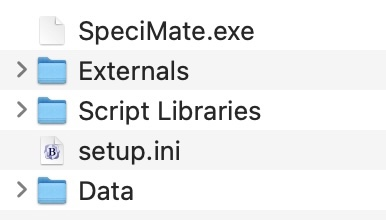

Figure 1 Windows application and folder setup.

## MacOS

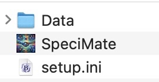

Figure 2 MacOS application and folder setup.

Inside the */Data* folder is the key application program called *OCR.livecode*. This contains all the working code for *SpeciMate*, while the application program itself is just a wrapper for that main functionality. This allows us to more easily provide customisation and updates by distributing a new *OCR.livecode* file rather than a completely new application.

## The SpeciMate-Data folder

Separately from the application, SpeciMate keeps its shared configuration in a **SpeciMate-Data** folder with three sub-folders:

```
SpeciMate-Data/
  definitions/    prompt (data) definitions — what to extract
  displays/       display layouts — how it looks during curation
  services/       one file per configured API service
```

You are asked to choose or locate this folder the first time you run SpeciMate, and again if it ever goes missing at startup. To change it later, use the **Choose SpeciMate-Data folder** option.

Two things follow from this layout:

* **Back up your image folders and your SpeciMate-Data folder separately** — neither contains the other.
* **API keys live in the `services/` folder in plain form.** Treat that folder as sensitive and do not place it on a shared drive that others should not read.

## Pre-processing

Before using this software, there are some pre-processing steps that may be necessary.

* Ensure the specimen images are:
  + JPEG format (PNG, GIF, BMP and TIFF are also accepted by the resize tool)
  + < 5 MB in size, though even 1 MB or less should still work ok for OCR of most specimens.

SpeciMate now includes a **resize** tool that will make reduced copies of a whole folder for you — see *Resizing a folder of images*. The external scripts described in the Appendices are no longer needed, but are retained there in case you prefer them. You can also use the custom ImageResizer application that can also export PDF pages to JPEG images for processing with SpeciMate.

---

# Main Processing Screen

The main processing screen provides the core selection and setup functionality for extracting the metadata from a folder of specimen images. It is a numbered sequence — work down it.

| Step | Purpose |
|---|---|
| **1. Project Setup** | Create or open a project; point at the image folder, select/create prompt definition |
| **2. Select Processes** | Choose which steps to run, and which model |
| **3. Prompt Details** | View/edit the definition |
| **4. Process Images** | Run the batch and watch progress |
| **5. Data Curation** | Open the curation windows and correct the results |
| **6. Data Check and Export** | Verify and write out the dataset |

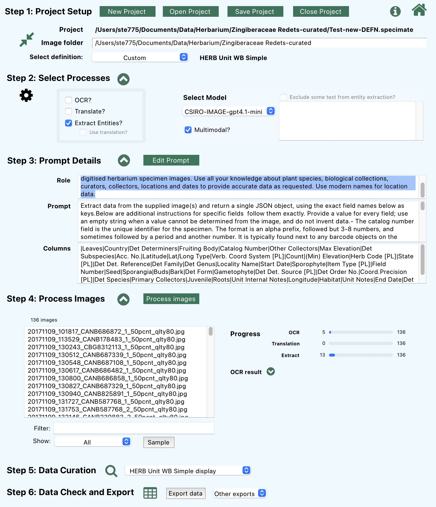

Figure 3 Main application window showing all six steps.


## Processing

* Create or open a project and point it at your folder of specimen images (see *Step 1 — Project Setup*).
* Choose a definition for this material (see *Step 3 — Prompt Details*).
* Select processing options — OCR, Translation if needed, Extract Entities (see *Step 4 — Processing a folder of specimens*).
* If entity extraction is selected, also:
  + Select the AI model to be used – see *Select AI model*.
  + Confirm the Role, Prompt and Columns are the ones you want – see *Definitions*.
* Click **'Process images'** to begin.

## Curation

* Open the project (if not already open).
* Select **Curation** from Step 5 to open the image and metadata windows.
* Edit metadata for each specimen (see *MetaData Curation*).
  + navigate between fields using tab.
  + next/prev specimen using up/down arrows.
  + tick **Checked** on each record you have finished with.
* If re-processing entity extraction is desired, you will also need to:
  + Select an AI model, as above.
  + Confirm the definition, as above.
  + Ensure “Extract Entities” is selected in processing options.
  + Note that records already marked **Checked** are protected — untick **Checked** first.

## Step 1 — Project Setup

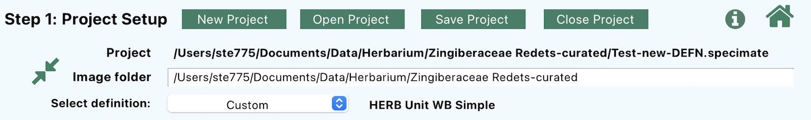

*(Screenshot needs updating — Step 1 now shows project name, image folder and the definition in use.)*

* **New Project** — give the project a name, then choose the folder holding your images. SpeciMate creates a `specimate` sub-folder there for the project's data. Project names must be unique within the folder.
* **Open Project** — continue an existing project. SpeciMate finds the projects that exist in a folder for you; you no longer have to hunt for the OCR `.bin` and NER `.JSON` files by hand.
* **Image folder** — the source folder. Everything else is derived from it.
* **Save Project** / **Close Project** — as expected. Closing clears the window.
* **Select definition:** – Select an option from the popup menu: choose a prompt definition from the library, create a new definition, or create a Tabular (form-based table data) definition.

The project remembers its definition, its active display layout, and where its OCR and extraction data files are. It does **not** contain the extracted data itself — that sits in separate files alongside, so you can keep more than one set of results for the same images. This is how you compare two models or two prompts on the same batch (see *Version control*).

Because the project lives inside the image folder, a project travels with its images. Hand someone the folder and they have the work.

## Step 3 — Definitions (Prompt Details)

Earlier versions asked you to pick a **specimen type** from a dropdown, and each type had a curation screen built into the application. That has been replaced by **definitions**, which you can choose, edit, create and share.

There are two related objects:

| | Prompt (data) definition | Display definition |
|---|---|---|
| Answers | What fields exist, and how the AI should extract them | How those fields are laid out during curation |
| Contains | Role, Prompt, ordered Columns (with types, formats, picklists, defaults, required flags) | Field order, groups, widths, multi-line hints, visibility, read-only, colours |
| Edited in | **Data Editor** | **Display Editor** |
| Stored in | `<SpeciMate-Data>/definitions/` | `<SpeciMate-Data>/displays/` |

One definition can have **several** displays — a full curation layout, a cut-down “quick check” layout, a read-only review layout. Switching between them never changes your data, only what you see and what you can edit.

Fields are linked between the two by a stable internal `fieldId`, which means a **column can be renamed without breaking any layout**. This removes the old restriction that column names had to be left alone.

One button at Step 3 fill in the Role, Prompt and Columns fields:

* **Edit Prompt** — adjust the definition currently loaded into this project.

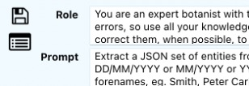

*(Screenshot needs updating — the buttons are now Library / New / Edit Prompt.)*

### Using the library

1. Click **Library**. The list shows every available definition with its name, creation date, type, number of columns (**# Cols**) and number of attached layouts (**# Displays**). Use the **Filter** box to narrow a long list.
2. Click a row — its Role, Prompt and Columns appear underneath so you can check it is the right one.
3. Click **Apply** (the green tick in the icon strip down the left side).

[New screenshot: definition library with a row selected, showing Role/Prompt/Columns beneath]

**Locked definitions.** A tick in the **Locked** column means the definition is protected — usually an institutional standard. You can apply one freely; you just cannot overwrite it. If you need a variation, select it and use the duplicate icon, then edit your copy.

### Choosing a display layout

If the definition has more than one layout, the **display selector** at Step 5 lists them. Pick one and it is applied immediately; if the curation window is open it redraws straight away. The selector is greyed out for definitions built with **Build Manually**, which only ever have one layout.

### Creating a definition

Click **New** in the library, then choose a route:

* **Analyse Example Images** — *the AI drafts the definition from sample images.* Best when you are not sure what fields the material can support. Name the definition, browse for **one to three** typical images, set the images type, and — most importantly — add **hints** describing what you want:

  > *Extract data items into meaningful natural history collections related columns. Mostly handwritten labels, some in French. I need collector, collection number, date, locality and habitat. Use Darwin Core field names where they apply. Ignore the barcode and accession stamps.*

  Click **Analyse**. When it finishes the status line reports something like *“Analysis complete - 12 columns found”* and the Data Editor opens with the draft. **Always review it** — rename verbose field names, add anything missed, delete anything you will never fill in, and set the column order — before processing a whole batch. A default layout is generated for you.

* **Build Manually** — *type it in yourself.* Enter a name, a one-line Role, a Prompt, and one column name per line. Then either **Use in project** to get straight to processing, or **Create Full Defn** to open the Data Editor and add types, formats and picklists.

* **Import a template** — for institutional template spreadsheets. See the *Admin Guide*.

All three create a definition belonging to **your project only**. Nothing reaches the shared library unless you explicitly choose **Save to Library…**, so you cannot disturb anyone else's setup by experimenting.

### Apply to Project vs Save to Library

| Button | Writes to | Use when |
|---|---|---|
| **Apply to Project** | Your project only | Tweaking a definition for this batch |
| **Save to Library…** | The shared library | You want to reuse it, or share it |

Editing your project's copy does not change the library version. Equally, changes you make in your project will not reach anyone else until you save to the library.

Definitions are covered in full in the *User Guide: Choosing and Using Definitions*.

## Step 4 — Processing a folder of specimens

There are 3 main processing options. All 3 can be selected if required and they will run in the correct order for each image selected. You can select 1 or more images to process from the file list. *Note* that you will need an internet connection, as these are online services (unless you have configured a local model).

*TIP: Hold the Control key down when clicking the Process button to process all the images in the list. (But test first, if needed.)*

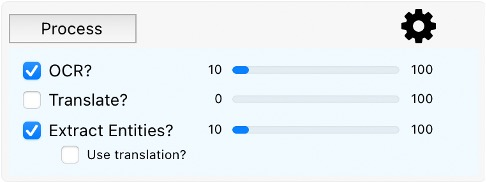

Figure 4 Process selection and status. This shows OCR and Extract Entities selected for processing, with the count of specimens already processed by each process type in this folder.

* Select whichever processes you wish to run:
  + **OCR?**
  + **Translate?**
  + **Extract Entities?**
* You can select all 3 at the same time, which will be faster than selecting each individually. *Note that while these processes run in sequence for each file, multiple files are processed at once to improve performance. You can view more details in the Log window.*
* The process will run on all selected files in the file list field. To process **all** files in the list, hold the *Control* key down when clicking the *Process* button.
* Translation may be necessary for some foreign language specimens. The checkbox “*Use translation?*” will use the results of the translation when performing entity (or data column) extraction.
* **Exclude some text from entity extraction?** — leave out text you know is noise, such as scale bars or accession stamps.

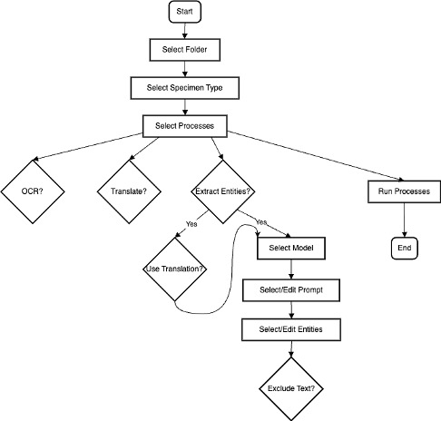

Figure 5 Processing flow overview.

Processing progress will be seen in the progress bars to the right of each process checkbox. The status line at bottom left reports what is happening, and the **OCR result** panel below shows the text read from the selected image. You can also view the processing log by opening the *Log* window.

*Note* that the order of processing is: 1. OCR 2. Translation 3. Extract Entities. Translation is optional, but OCR must be performed before any other process can run. All can be selected at once and the correct process order will be followed automatically.

### Finding what still needs doing

The file list has two controls that save a lot of money on large batches:

* **Filter** — narrow the list by text.
* **Show** — switch between all files, processed files and unprocessed files.

After an interrupted run, **Show unprocessed** is the quickest way to process only what is missing rather than paying to redo the whole batch. Processing an image again overwrites its previous result for that stage.

### Interruptions and errors

* If a provider **rate-limits** SpeciMate, processing pauses and resumes automatically after a backoff, and the affected image is re-queued.
* **Server errors** are handled the same way, with a shorter wait.
* Other errors — a bad key, a malformed request, an unknown model name — are logged and **not** retried, because they will not fix themselves.

If a run appears to have stalled, check the **Log** window first.

## OCR

This uses an OCR service that you configure — typically Google Cloud Vision — and requires a network connection. Services have limits on filesize, so images should be reduced from the originals. Ideally < 5 MB JPEG format, while < 1 MB also works fine in testing. See *Resizing a folder of images*.

## Translation

Translation is performed by the translation service you configure — typically Google Cloud Translation — and requires a network connection. It is only invoked when the OCR result reports a detected language that is not English or Latin with reasonable confidence, so it costs nothing on English-only batches.

## Metadata Entity Extraction

Metadata entity extraction uses a Large Language Model to extract named entities, or data items, from the specimen text produced by the OCR and translation processes. Any OpenAI-compatible endpoint can be used — OpenAI, Azure OpenAI, OpenRouter, Google Gemini, or a local model running on your own machine.

Anytime you will be running the entity extraction, you should select the model of choice and check the definition (Role, Prompt and Columns) you want to use. When you're curating the resulting metadata, you should also ensure this has been done before re-running this process.

### Select AI model

Select the AI model (LLM) that will be used for extracting the desired entities. The available models must be set up prior to selection (see *Services selection and setup*). The dropdown lists the services you have marked **Active**, so what you see depends on your own configuration rather than a fixed list.

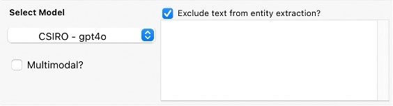

Figure 6 LLM model selection.

Guidance that still holds:

* A small, fast model (for example `gpt-4.1-mini`) is good, fast and cheap — usually the right starting point.
* A larger model (for example `gpt-4.1` or a reasoning model) is more accurate on difficult handwriting, and costs more.
* Test on a handful of images and check your provider's usage dashboard before committing to a large batch.

Here you also have the option to choose a multimodal model. If you select the “**Multimodal?**” checkbox, the available models in the dropdown menu will change to reflect this.

* *Exclude text from entity extraction?*
* If desired, check the box and enter lines of text from the OCR process that should be excluded from the extraction process. These might include terms from scale or colour bars or any other terms that are unneeded.
* **Caution**: *be careful of entering single words or characters that will be excluded from everywhere in the text.*

#### Multimodal model

A multimodal model can process images as well as text. In this case, we have the option to perform all of OCR, translation and entity extraction in one single pass using a single AI multimodal model. The immediate effect here is that we do not then run the OCR and translation processes, and we also are not able to exclude text from the entity extraction process.

This can be a good option for specimen images without difficult handwriting and/or using relatively standard languages, and for layouts that OCR handles poorly. It can also be a good option for handling pictograms, such as gender symbols. It needs a **Multimodal** service configured, and it costs more, because images are billed as tokens.

### Prompt Customisation Examples

Parts of the definition can be customised, both in the main window and in the Data Editor. Remember the distinction: **Apply to Project** affects only this project, **Save to Library…** changes the shared copy.

Useful ideas to explore here are formatting options for data items.

Date examples:

* YYYY-MM-DD -> 1987-04-25
* DD-Mon-YYYY -> 25-Apr-1987
* Instruction example: *Convert any dates to DD-Mmm-YYYY or Mmm-YYYY or YYYY depending on the data supplied.*

> **Caution on quotation marks.** The request sent to the model is assembled by substituting your Role and Prompt into a text template. A raw double quote or backslash in prompt text can break that request and cause the call to fail. Use single quotes for emphasis until per-value escaping is applied everywhere.

---

# Working with images

## Resizing a folder of images

The **resize** button on the main window makes reduced copies of every image in a folder. Large images cost more, process more slowly, and are rejected outright by some APIs.

1. Click it and enter a maximum dimension in pixels (2048 is the default and is usually plenty for label text).
2. Choose the source folder, then a **different** target folder.
3. Optionally choose a resize quality — *normal* is the default and is fast; *good* and *best* are slower but sharper.

Images already smaller than the limit are copied unchanged. The run reports how many were processed, skipped and failed. **Click the button a second time to stop** — the current image finishes, then the run halts.

Supported types: JPG, JPEG, PNG, GIF, BMP, TIF, TIFF.


## View Specimen Image

To view any specimen image from the main window, either:

* Double-click on an image name in the list of images; or
* Click the magnifying glass from Step 5 of the main screen; or
* Open the control panel and select “*Images*”.

### Zoom/move/rotate/reset

Use the mouse scroll wheel to zoom in and out. Alternatively double-click to zoom in, shift-double-click to zoom out.

Hold the mouse button down and move the image.

**Reset** the image using the  button to return to original scale with no rotation.

**Rotate** the image 90º using the  button. Shift-click to rotate in the other direction.

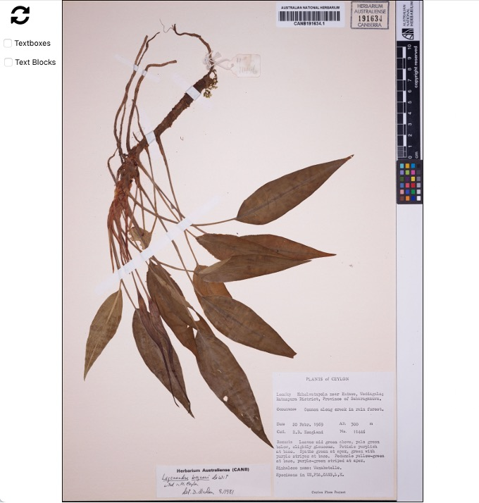

Figure 7 Image of herbarium specimen.

---

# MetaData Curation

After processing or loading a project, you should check and edit the resulting data to ensure it is the quality you're expecting. As the prior processes are not always 100% correct, we need to add our knowledge and skills to ensure the data are of high quality.

To display the metadata curation screens, select the curation button  at Step 5. This will open both the image display showing the current specimen image and the metadata editing screen. If no metadata are displayed, select a specimen image in the list on the main screen to explicitly load that image and data.

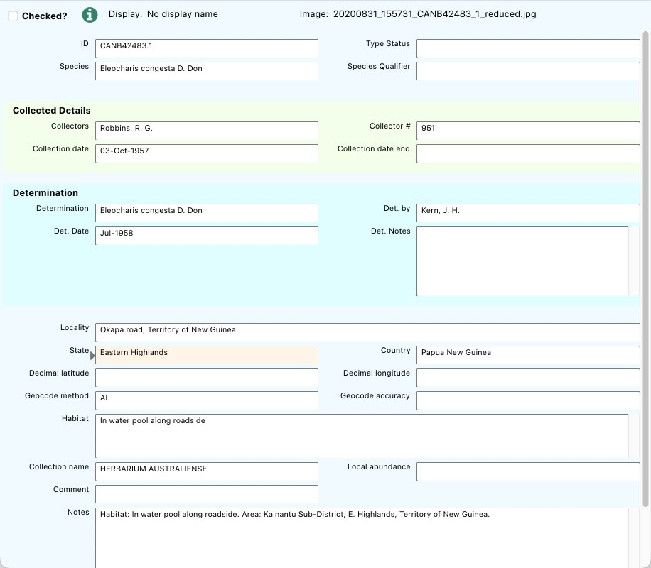

Figure 9 Example metadata screen. The layout comes from the project's active display definition, so it will look different for different definitions and layouts.

* **Edit** the fields as required. **Tab** between fields. Changes are automatically saved.
* **Up** and **down** arrows will move between images (i.e. will load previous or next specimen).
* If a **picklist** has been defined in the detailed prompt definition process, it will appear when you enter a field and allow you to select an item from the defined set.

## The form comes from the display definition

The metadata form is generated, not built in (except for the Table-based form). Fields may be grouped under coloured headings, full or half width, single or multi-line, and some may be read-only — all of that is set in the **Display Editor**. If a field you expect is missing, it is most likely hidden in the active display rather than absent from the data.

### Picklists

Fields with a defined list of accepted values show a popup. You can type into the field and pick from the keyboard; choosing a value moves on to the next field automatically.


### Validation colours

A field's background may tell you about its value:

| Colour | Meaning |
|---|---|
| Pink/red tint | Required field empty, wrong type, or a value not allowed by a closed picklist |
| Amber tint | Value not in the picklist, but the picklist allows custom entries |


### Map

If the record has usable decimal latitude and longitude, a map appears showing the point. Coordinates that are not numeric are flagged rather than plotted.

### Switching display layout

The display selector at Step 5 lists every layout attached to the current definition. Pick one and the curation form redraws immediately. Your data is untouched; only the arrangement, visibility and editability of fields change. The selector is disabled for simple, manually built definitions, which only ever have one layout.

You can also change layout from the popup menu at the top of the Custom curation screen, if there are multiple displays defined for this data.


### Record status

| | |
| --- | --- |
| ***Checked?*** | Select this when you've finished checking this specimen. This is the flag that matters most: it is included in the export, and it prevents accidental re-processing. |

Table 1 Record status controls on the metadata window.

There may be other checkboxes, depending on the definition in use — for example checkboxes for the presence of buds/flowers/fruit on herbarium specimens, or a *Type specimen?* flag. These come from the definition's columns, so they vary with the material.


### For experts: Debug button

NB: Only available in the Tabular curation screen.

This may be useful if something unexpected happens, e.g. data is not displayed as expected or display columns are not found.

Use this to display a table of data which includes all the columns that we've extracted, but also other possibly useful information.

e.g. Results – this contains various information that has been returned from the LLM entity extraction process, including model used, the prompt that was used, as well as the raw content that has been returned from the LLM (see *results->choices->1->message->content* and click on the small icon to the right of the line. This will display the raw results (should be in JSON format).


---

# Whole Dataset curation

## Overview

Anytime during processing you can check how your whole dataset is looking for export. Selecting “*Check*” at Step 6 will collate the current data and display it in the **Data Table** window. This provides an overview of all your data which should be useful in identifying specimens that may need further processing (either re-processing or curation) before exporting.

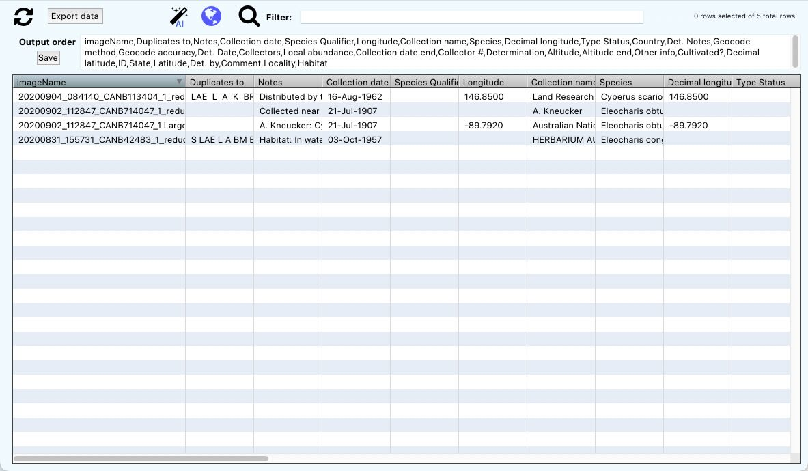

Figure 11 Data Table window.

* **Select** a row to display the image and metadata in the curation windows.
* **Re-process** selected rows by clicking the  button at the top.
* **Sort** the data by clicking on any column header to sort by that column. Click on the header again to reverse the sort order. This is useful, for example, when looking for rows with blank columns which you would expect to contain data. Another example is after running the data checks described below and sorting to show rows with possible problems.
* 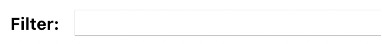 **Filter** rows containing any text string by entering text in the filter field. This will update the list automatically.
* **Find** data matching a string within one column by clicking the magnifying glass icon. This will bring up the search window allowing you to find text within any column. Matching rows will be selected (highlighted) as below.


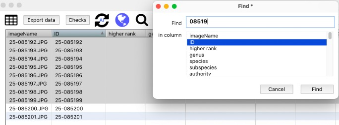

Figure 12 Find string in a column within the Data Table window, showing the highlighted lines that satisfy the search.

## Map window

*  Display selected records on a map. If not yet done, you will need to specify column mapping before the map is displayed. This maps columns used in the map to column names from your dataset.

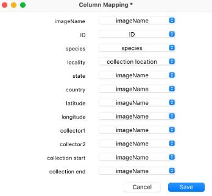

Figure 13 Column mapping before displaying dataset in the map-timeline window.

* After doing the column mapping, click the icon again to display all specimens on the map and timeline. You can zoom in and out in the map and the timeline, change from map to satellite image, mouseover a specimen to show more detail, and select a specimen in either map or timeline to have it selected in the other view.
* Shift-click to change the mapping.
* Control-click to display only selected specimens on the map.

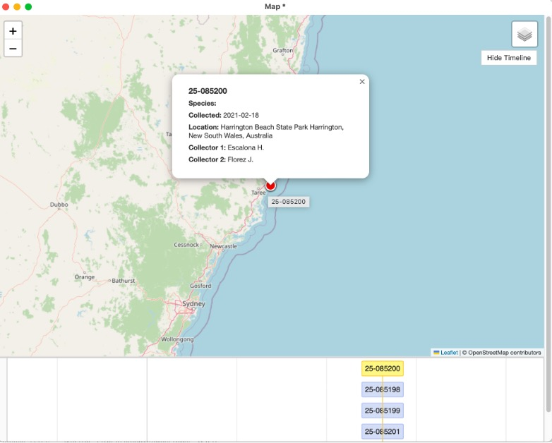

Figure 14 Specimen map window showing specimen metadata.

## Output order — choosing what gets exported

The **output order** field defines exactly which columns are exported and in what order: a comma-separated list of column names. This enables you to easily re-arrange output order for further downstream processing. Two special forms are available:

| Spec | Effect |
|---|---|
| `locality` | Ordinary column |
| `#verified` | Column headed `verified`, with the literal value `verified` in every row |
| `@yearExtracted=2026` | Column headed `yearExtracted`, with `2026` in every row |

`@name=value` is the preferred way to add a fixed column — an institution code, a project identifier, a processing year. The first `=` separates name from value; any further `=` characters stay in the value.

Your output order is saved with the project.

[New screenshot: output order field containing a mix of ordinary and @constant column specs]

## Export Dataset to TSV

When you've finished curating the dataset, click **Export data** in the Data Table window and choose a filename. SpeciMate writes tab-separated text (.tsv, UTF-8), ready for the next steps in the curation process. This may be OpenRefine or Excel for further data refinement and wrangling, or direct into the Specify WorkBench, or another workflow process.

Notes on what you get:

* **imageName** is always included, whether or not you listed it.
* **Checked** is added as an extra column.
* **Duplicate column headers stop the export.** If two specs resolve to the same header name, SpeciMate reports the clash rather than writing a malformed file. Fix the output order and try again.

There is a separate **export OCR text** action if you want the raw OCR read text rather than the extracted fields (if you have run the OCR process).

---

# Definitions and Displays Reference

## The library

The library window browses both definitions and displays. From here you can:

* *Select* a definition to view its details in the fields below.
* *Apply* it to the current project with the green tick.
* *Filter* a long list with the Filter box.
* *Sort* the list columns as desired by clicking on the column header.
* *Duplicate* a definition — the only way to modify a locked one.
* *Lock* a definition so it cannot be overwritten. Locked definitions are usually institutional standards.
* *Delete* a definition from the list.
* *Export* definitions to a JSON file for sharing with other users.
* *Import* definitions from a saved JSON file. Use with ***caution*** — you may want to export your current definitions first.

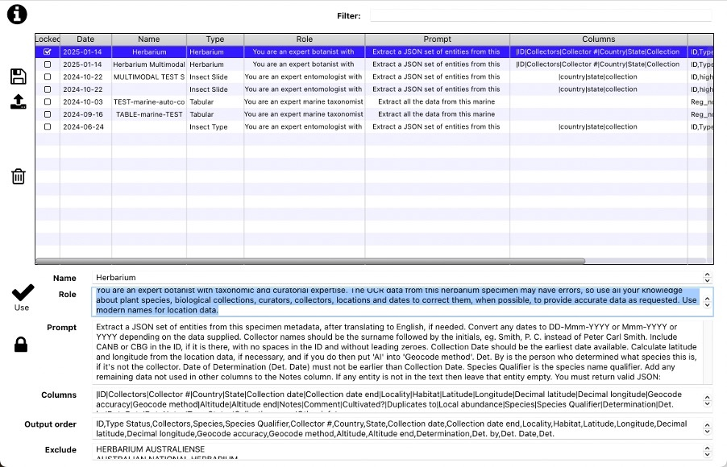

Figure 15 Definition library.
*(Screenshot needs updating — the library now shows # Cols, # Displays and Locked columns, and the Apply / New / Duplicate icon strip.)*

## Definition components

Consists of: Role, Prompt, Columns definition (with types, formats, picklists, defaults and required flags), and Excludes. Output order is now set per project in the Data Table window rather than stored in the definition.

### Role

* Contextual info to “set the stage”
* Assists to get AI model into “right knowledge space”
* Differs between text (OCR) and multimodal prompts

### Prompt

* Explicit detailed instructions on what we want to achieve
* May be customised for a set of images
* Probably shouldn't be customised for image subsets, but can be
  + E.g. for re-processing problematic images
  + May make sense to alter prompt and re-process a subset if they have similarities that can be addressed
* Include extraction hints
  + E.g. “Include CANB or CBG in the ID, if it is there” for herbarium images
* Include special formatting
  + E.g. names, dates
* Include inferencing instructions, if desired
  + E.g. use current country names
  + E.g. calculate decimal lat-lon if possible
* Include logic if this may be of help
  + E.g. Determination date cannot be before Collection date.
* Instruct the model what to do when it cannot read something
  + E.g. “Return an empty string for anything you cannot read with confidence — do not guess or infer values that are not written on the label.”

### Columns

* Defines the data to be extracted
* Name definition can have an effect on extraction accuracy
* Column order in the definition is the order shown in the Data Editor; the exported order is set separately in the output order field
* **Columns can now be renamed safely.** Layouts link to a stable internal `fieldId`, not to the name, so renaming a column does not break a display. Run **Refresh** in the Display Editor afterwards to pick up the new label.
* Adding a column does not automatically add it to a layout — open each affected display, click **Refresh** (new columns arrive hidden), then **Toggle Visible**.
* Fields named things like *Notes*, *Habitat*, *Locality*, *Description* and *Remarks* are automatically given wider, multi-line boxes on screen.

### Excludes

* Useful to exclude irrelevant text to decrease errors
* Excludes text being passed to entity extraction
* Only useful after OCR
* Not used with multimodal models
* Take care with small entries or numbers as ALL occurrences will be excluded from the text

## Adjusting the layout — the Display Editor

If you want to change what appears on the curation screen — not what is extracted — click **Display Editor** in the Data Editor. A menu lists the layouts already attached to this definition, plus **Add New Display**.

Each row in the Display Editor is one field, top to bottom in the order it appears on screen. The controls you are most likely to want:

* **▲ Move Up** / **▼ Move Down** — reorder fields.
* **Toggle Visible** — hide a field you never fill in. It stays in the list here, so you can bring it back. Hidden fields still hold data and still export.
* **Toggle Span** — `1` is half width, `2` is full width across the form.
* **Render Hint…** — `single-line`, or `multi-line,N` for a taller box.
* **Toggle ReadOnly** — show a field but stop it being edited.
* **Set Group…** / **Edit Group** / **Pick Colour…** — group fields under a coloured heading.
* **Preview** — see the form as curators will get it, before committing.
* **Refresh** — pull in changes made to the definition's columns.
* **Data Editor** — go back to the columns view.

Finish with **Apply to Project**, or **Save to Library…** to keep the layout for future projects. To base a new layout on an existing one without changing it, use **Duplicate** in the displays library and edit the copy.

[New screenshot: Display Editor grid with several fields, one grouped and coloured]

---

# Services selection and setup

Services are the AI models (or services) that we have available to us via APIs (programmatic calls to them). These are usually web-based models, but can also be local — running on your own PC via LM Studio, Ollama or similar. Local models are now genuinely usable, though generally slower and less accurate than the commercial services.

Typical setups use Google Cloud Vision for OCR, Google Cloud Translation for translation, and an OpenAI-compatible endpoint for entity extraction. That endpoint can be OpenAI, Azure OpenAI (which is how the CSIRO-managed services are provisioned), OpenRouter, Google Gemini, or a local server.

**Services are no longer password-protected or fixed.** You define them yourself, and each one is stored as a JSON file in the `services/` folder of your SpeciMate-Data folder. Full step-by-step instructions, including how to obtain accounts and API keys from each provider, are in the separate **Setting Up Services** guide. What follows is an orientation.

## Service types

| Type | What it does | When you need it |
|---|---|---|
| **OCR** | Reads text from a specimen label image | Required for the OCR step |
| **Translation** | Translates non-English OCR text into English | Only for foreign-language labels |
| **LLM** | Extracts metadata fields from OCR **text** | Required for entity extraction |
| **Multimodal** | Extracts metadata directly from the **image** | Only if you use Multimodal processing |

You can define as many services of each type as you like and choose which are active and which is the default for each type.

## Default Service Selection

To access the service selection window, click the cog icon in the “Process progress” area in the main window. Each drop-down menu displays the active services available for OCR, Translation, LLM and Multimodal.

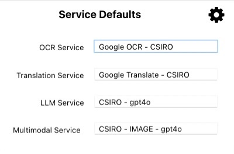

Figure 16 Service selection window, showing the default services for OCR, Translation and LLM entity extraction.

If no default has been chosen for a type, SpeciMate falls back to the first active service of that type and notes this in the Log.

## Service Definition

Open the Services screen from **Service Selection → Configure services**. It has three parts: the **Services Folder** at the top, the **service list** on the left (with New, Duplicate and Delete), and the **editor** on the right. Buttons at the bottom are **Export**, **Import**, **Test** and **Save** / **Cancel**.

### Service components

| | |
| --- | --- |
| *Service Name* | Name of each service, displayed in menus within the application. Must be unique — it becomes the filename on disk, so keep it stable once you rely on it. |
| *Active?* | Is this service currently available for selection? Inactive services are kept but hidden. |
| *Service Type* | One of: *OCR, LLM, Multimodal, Translation*. Controls which other fields are enabled. |
| *Model* | The provider's exact model identifier, e.g. `gpt-4.1-mini`. Disabled for OCR and Translation. |
| *URL* | The exact URL that data will be POSTed to. |
| *API Key* | The special key that authorises access to a service. This should be kept secret to avoid others using your service. Obtained from each service provider. |
| *Header text* | HTTP headers to send, one per line, as `Name: value`. |
| *Template* | The JSON request body, containing placeholders that are substituted with specimen-specific data at runtime. |
| *max. Tokens* | Specific to LLM/Multimodal requests: a maximum number of tokens per request. |
| *max. Concurrent Requests* | The maximum number of requests SpeciMate will have in flight at once for this service. |

Table 3 Service definition components.

**max. Concurrent Requests** is the setting to reduce first if you start seeing rate-limit errors during a batch. `20` is reasonable for a commercial API; drop it to `2`–`4` for a local model or a free tier.

### Placeholders

The URL, headers and template are plain text. SpeciMate fills in the variable parts by substituting placeholders immediately before sending the request. **Spelling and brackets must match exactly.**

| Placeholder | Replaced with | Used in |
|---|---|---|
| `[XXXX]` | The API Key field | URL and Header text |
| `[BASE64_ENCODED_IMAGE]` | The image, base64-encoded | OCR, Multimodal templates |
| `[TEXT]` | The text to be translated | Translation template |
| `[TEXT_TO_BE_PARSED]` | The OCR'd (or translated) text | LLM template |
| `[MODEL]` | The Model field | LLM, Multimodal |
| `[ROLE]` | The Role from the current definition | LLM, Multimodal |
| `[PROMPT]` | The Prompt from the current definition | LLM, Multimodal |
| `[ENTITIES]` | The list of fields to extract, from the definition | LLM, Multimodal |
| `[MAXTOKENS]` | The max. Tokens field | LLM, Multimodal |

Note the two different text placeholders: translation uses `[TEXT]`, the LLM uses `[TEXT_TO_BE_PARSED]`. They are not interchangeable.

> **Don't press Return inside a quoted string in the template.** A literal line break inside a JSON string is invalid JSON. Use `\n` instead. You can lay the template out over several lines freely — just not in the middle of a `"..."` value.

### Checking and testing

* **Check** (next to the Template field) parses the template as JSON and reports whether it is valid. It does not verify placeholders, so also read through and confirm each one you need is present and correctly spelt.
* **Test** builds a small request using the same substitution path as real processing and shows you the response. This is the fastest way to confirm endpoint, key, headers and template all work together. Hold **Shift** while clicking Test to use a real image of your choosing.

### Service definition screens

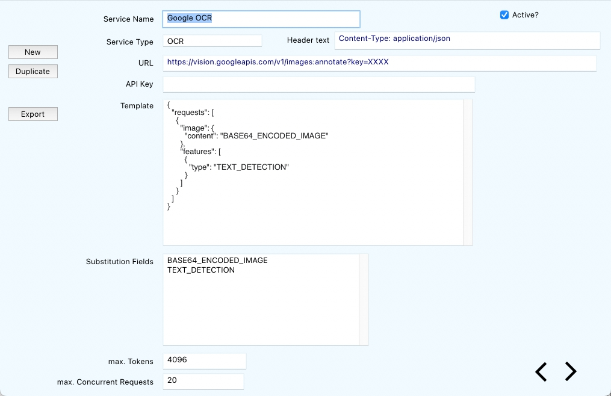

Figure 17 OCR service definition screen. This is the Google Vision OCR service.

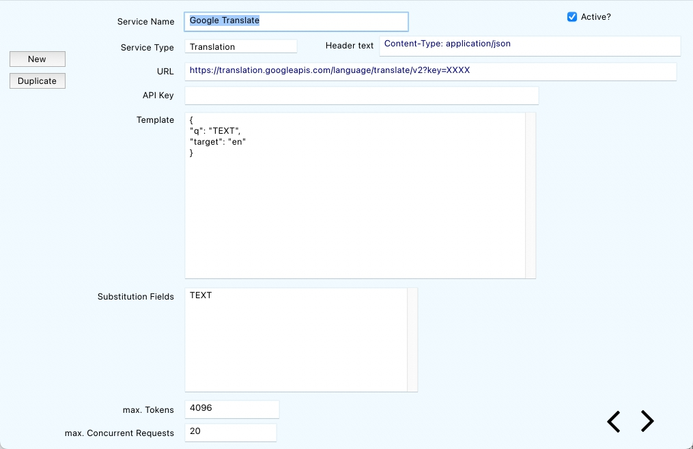

Figure 18 Translation service definition screen. This is the Google Translate service.

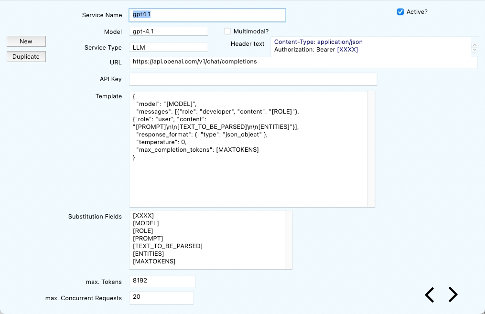

Figure 19 LLM service definition screen.

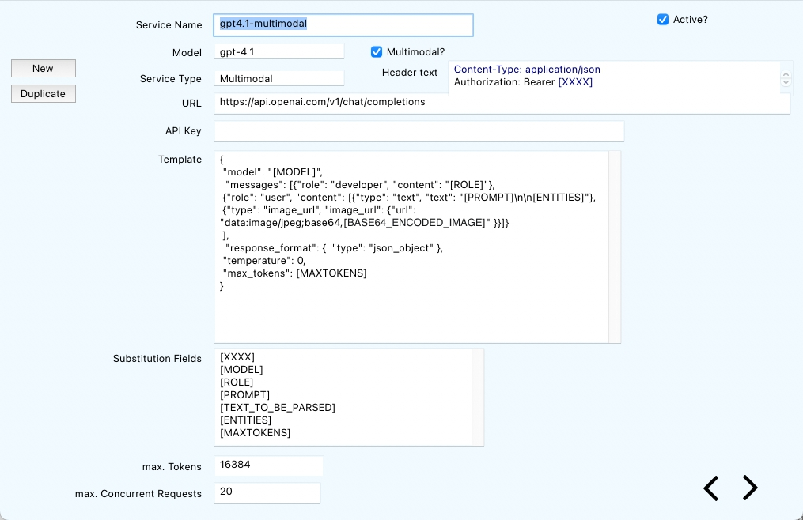

Figure 20 Multimodal LLM service definition screen.

### A note on model families

OpenAI split its request parameters partway through the GPT-5 generation, and the older parameters are now rejected rather than ignored:

| Your model | Token limit parameter | `temperature` |
|---|---|---|
| `gpt-4o`, `gpt-4.1`, `gpt-4.1-mini`, and most local/open models | `max_tokens` | Allowed — use `0` |
| `gpt-5*`, `o1`, `o3`, `o4-mini` and other reasoning models | `max_completion_tokens` | **Not allowed** — omit entirely |

Ready-to-paste template variants for each case are in the *Setting Up Services* guide.

### Sharing services

* **Export** writes the selected service to the Services Folder. Hold **Shift** to export all; hold **Control** to choose a different destination.
* You are asked whether to **include the API key**. Answer **No** for anything you intend to share, commit or email — an exported file with a key in it is a plaintext credential.
* **Import** reads every `.json` file in the Services Folder and **replaces your whole service list**. To update only certain services, select those rows first and hold **Shift** while clicking Import.
* Expect to re-enter API keys after importing a colleague's service definitions.
* **Delete** does not destroy a file — it moves it to a `deleted` sub-folder.

---

# Control Panel

Open the control panel using the  button on the main window. Open any window within the application by double-clicking on its name.

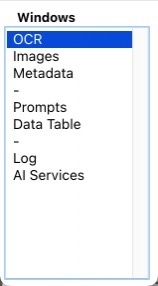

Figure 21 Control panel for selecting application windows.

The windows available are:

| Window | Use |
|---|---|
| **Services** | Configure OCR, Translation, LLM and Multimodal services |
| **Prompts / Library** | Browse, filter, duplicate, lock and delete definitions and displays |
| **Data Editor** | Edit a definition's columns, types, formats and picklists |
| **Display Editor** | Edit a layout — order, visibility, width, grouping, colour |
| **Data Table** | Grid view of extracted data, output order, export |
| **Map** | Plot all geolocated specimens in the project |
| **Images** | The specimen image window |
| **Log** | Running record of what SpeciMate did — the first place to look when something goes wrong |

There is no general preferences screen. The only setting you change directly is the **SpeciMate-Data folder**. Everything else that persists — window positions, the last project, and so on — is remembered automatically.

---

# Version control

Version control is semi-automatic. When a project is processed and saved, data files are written into the `specimate` folder inside your image folder:

1. `OCR.bin`
   1. This contains detailed OCR and translation data.
2. `NER.JSON`
   1. This contains detailed entity extraction data for each specimen.

Because the project file records which data files it is using, and the data lives separately, you can keep more than one set of results for the same images. To manage these you may like to rename a version using a more meaningful name. This should be fine, as long as you ensure the suffixes `.bin` and `.JSON` remain on the end.

Renaming a version may be useful, for example, if you want to compare the results from using 2 different models for entity extraction, or the same model with 2 different prompts.

## Where your data lives

| Location | Contents |
|---|---|
| `<SpeciMate-Data>/definitions/` | Prompt definitions |
| `<SpeciMate-Data>/displays/` | Display layouts |
| `<SpeciMate-Data>/services/` | Service configurations, including API keys |
| `<image folder>/` | The project file (with .specimate suffix) |
| `<image folder>/specimate/` | OCR and NER extraction data files |

**Sharing a project means sharing the image folder.** If the recipient does not have the matching display in their SpeciMate-Data folder, SpeciMate falls back to the copy stored inside the project file, so the layout still works.

---

# Troubleshooting

## Log

The log displays messages during application execution. These may be both process-related as well as error messages.

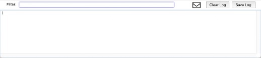

Figure 22 Log window — filter the lines of the log, clear or save the log, and email log contents to the developer for error or process debugging.

Within this window you can do the following:

| | |
| --- | --- |
| Search/Filter | Enter a text string. All lines containing this text will be displayed. |
| Clear | Clears the log. |
| Save | Save the log to a text file in the current project folder. |
| Email | Email the logfile to the developer for information/error tracking. |

Table 4 Functions available in the Log window.

## Common problems

**Nothing happens when I click Process images.**
Check that a project is open, an image folder is set, at least one process is ticked, and a definition is loaded. The Log window will usually say which is missing.

**Processing stops partway through.**
Most often a rate limit — SpeciMate pauses and resumes on its own, so give it a minute. If the Log shows repeated 4xx errors, the key, URL or model name is wrong; those are not retried. Reduce **max. Concurrent Requests** on the service if rate limits are persistent.

**All the extracted values are empty or nonsense.**
Look at the OCR result panel first. If the OCR text is poor, no amount of prompt tuning will help — try better images, or Multimodal extraction. If the OCR text is fine, the Prompt and Columns are the thing to adjust.

**A field I expect is not on the curation screen.**
It is probably hidden in the active display. Switch display, or use **Toggle Visible** in the Display Editor. Hidden fields still hold data and still export.

**A field I added to the definition isn't on the curation screen.**
Displays don't pick up new fields automatically. Open the display definition, click **Refresh** — new fields arrive hidden — then **Toggle Visible** on the one you want and save.

**My column order is wrong in the export.**
The output order field at Step 6 controls export order, independently of the order in the definition.

**The export failed with a duplicate-header message.**
Two entries in the output order produce the same header — often an ordinary column and a `#` or `@` spec with the same name. Rename one.

**A definition will not save.**
It is probably locked. Duplicate it and edit your copy.

**My changes did not reach my colleagues.**
You used **Apply to Project** instead of **Save to Library…**.

**The display selector at Step 5 is greyed out.**
Your definition was built with **Build Manually** and has only one default layout. Use **Create Full Defn** to get the full structure.

**Analysis came back with 0 columns found.**
Check that a Multimodal service is configured and working on the Services screen. If the service is fine, sharpen your hints and try again with different example images.

## Error Messages

Explanation and resolution for common error messages. Errors in the log will be prefixed with “\*\*\* Error:” followed by the error description.

| | |
| --- | --- |
| \*\*\* Error: Error with LLM call: <imagename.JPG> tsneterr: (35) SSL peer handshake failed, the server most likely requires a client certificate to connect | There was a problem making a service call to process the metadata. *Possible Actions:* 1. Check internet connection. 2. Save your data and restart the application. 3. Try again later, possibly the service is down or has changed. 4. If the error is persistent then email the log file to the developer using the email icon on the Log window and/or contact your local support. |
| `401` / `403` / “invalid API key” | Key wrong, expired, or missing `[XXXX]` in the URL or header. |
| `404` | URL wrong — check the path, deployment name and API version. |
| `400` with a JSON parse complaint | Template malformed, or a placeholder left unsubstituted. Use **Check** on the template. |
| “Unsupported parameter: `max_tokens` … use `max_completion_tokens`” | Template is the older variant on a newer model — use the reasoning-model template. |
| “model not found” | Model field doesn't match the provider's exact string. |
| `429` | Rate limited — reduce max. Concurrent Requests. |
| Nothing at all / connection refused | Local model server not running, or wrong port. |
| “No template data supplied” | Template is empty, or doesn't start with `{`. |

Table 5 Error messages and descriptions.


---

# A typical session, end to end

1. Resize the image folder if the originals are large.
2. **New Project** → name it → point at the images folder.
3. Step 3 → **Library** → select the definition for this material → **Apply**.
4. Step 2 → tick **OCR?** → **Process images**. Check a few OCR results.
5. Step 2 → untick OCR, tick **Extract Entities?** → **Process images**.
6. Step 5 → **Curation**. Work through the records, correcting values and ticking **Checked** as you go. Use **Problems** for anything you cannot resolve.
7. Step 6 → **Check** the dataset, set the output order, add any constant columns → **Export data**.
8. Save the project.

---

# Appendices

## Pre-process Images

Use the built-in **resize** tool on the main window in preference to anything below — it handles a whole folder, reports what it did, and can be stopped cleanly. The following are retained for anyone who prefers an operating-system workflow.

If other options are not possible, also available is a custom image resizer application which also provides the ability to convert PDF document pages to JPEGs for use within SpeciMate. Check where you downloaded this application from.
